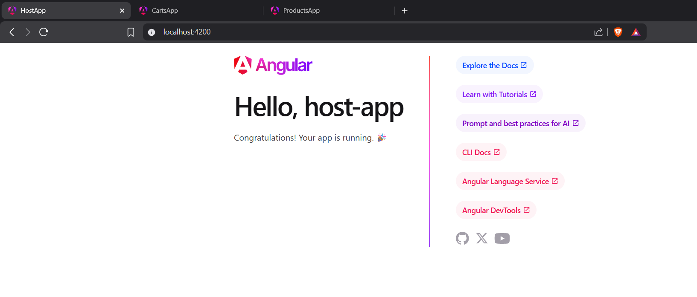
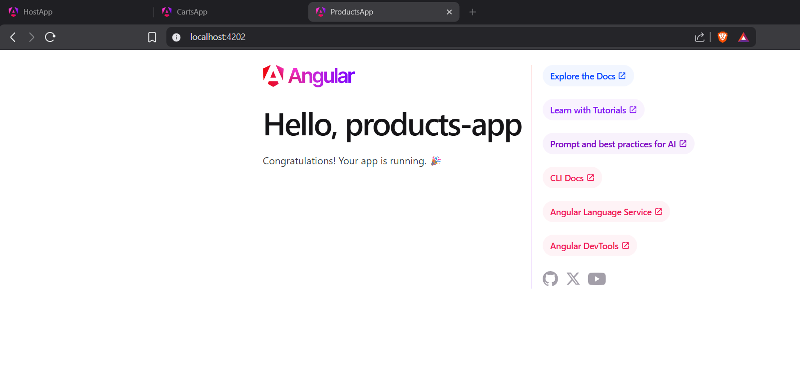

ng new amazon --create-application=false
cd amazon
ng g application host-app
ng g application products-app 
ng g application carts-app   

npm i -D @angular-architects/native-federation 
ng g @angular-architects/native-federation:init --project host-app --port 4200
ng g @angular-architects/native-federation:init --project carts-app --port 4201
ng g @angular-architects/native-federation:init --project products-app --port 4202

ng s host-app

ng s carts-app

ng s products-app

npm install --save-dev concurrently

to run all apps at once use this command in package.json file
"serve-all": "concurrently \"ng serve host-app\" \"ng serve carts-app\" \"ng serve products-app\""
then run npm run serve-all

"build-all": "concurrently \"npm run build:host-app\" \"npm run build:carts-app\" \"npm run build:products-app\""

