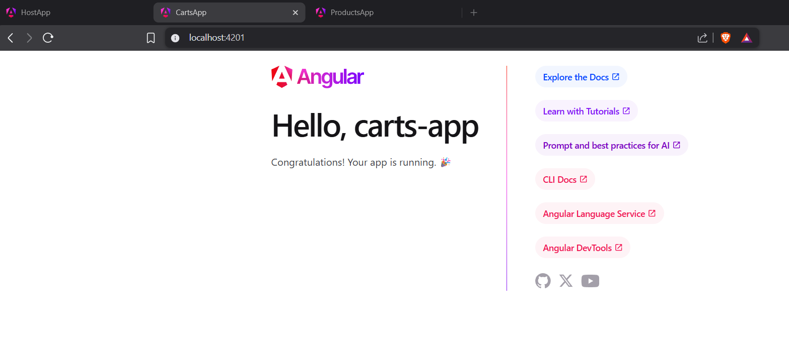

ng new amazon --create-application=false
cd amazon
ng g application host-app
ng g application products-app 
ng g application carts-app   

npm i -D @angular-architects/native-federation 
ng g @angular-architects/native-federation:init --project host-app --port 4200
ng g @angular-architects/native-federation:init --project carts-app --port 4201
ng g @angular-architects/native-federation:init --project products-app --port 4202

ng s host-app

ng s carts-app

ng s products-app

